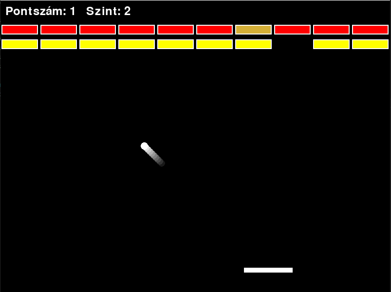

# Brick Breaker – Classic Game Built with Pygame

This is a classic **Brick Breaker** game created using the [Pygame](https://www.pygame.org/news) library. You control a paddle to bounce a ball and break bricks. Score points for each brick broken. Golden bricks appear occasionally and grant bonus points. The game includes animated effects, sound, music, and multiple difficulty levels.

---

## 🌹️ Gameplay

- Control the paddle using arrow keys.
- Bounce the ball to break bricks.
- Different bricks may require multiple hits or give more points.
- Golden bricks grant 5 bonus points when destroyed.
- Lose the ball and restart the level.
- Choose between 3 difficulty levels.
- Enjoy background music and sound effects.

---

## 🧱 Structure

- **Pygame window:** Fixed-size game field with UI elements.
- **Main features:**
  - Paddle and ball movement
  - Multiple brick types (including golden bricks)
  - Animated effects (ball trail, paddle squash)
  - Sound and music system (mute with `M`)
  - Difficulty selection screen
  - Restart and navigation options (R, N, Q)

---

## 🛠️ Installation & Running

### Requirements

- [Python 3](https://www.python.org/)
- [Pygame](https://www.pygame.org/news)

Install pygame with pip:

```bash
pip install pygame
```

### Running the game

Save the file as `brick_breaker.py`, then run:

```bash
python brick_breaker.py
```

---

## 🧠 Features Overview

- 3 selectable difficulty levels (Easy, Medium, Hard)
- Animated paddle squash and ball trail effects
- Special golden bricks worth extra points
- Background music and sound effects (mute/unmute with `M`)
- Restart level with `R`, return to lobby with `N`, and quit with `Q`

---

## 📷 Screenshot



---

## 📄 License

This project is free to use for learning purposes.

---

**Have fun playing! 🧱**

---

# Brick Breaker – Klasszikus játék Pygame alapokon

Ez egy klasszikus **Brick Breaker** játék, amelyet a [Pygame](https://www.pygame.org/news) könyvtár segítségével készítettünk. Az ütőddel irányítod a labdát, amely színes téglákat tör össze. Pontokat kapsz minden eltüntetett tégláért. Időnkként aranytéglák jelennek meg, amelyek extra pontot érnek. A játék animációkkal, zenével, hangeffektekkel és többféle nehézségi szinttel rendelkezik.

---

## 🔹 Játékmenet

- A nyilakkal mozgatod az ütőt.
- A labdával kell eltüntetni a téglákat.
- Egyes téglák több találatot igényelnek, vagy több pontot adnak.
- Az aranytéglák 5 bónuszpontot érnek.
- Ha elveszítetted a labdát, újrakezdődik a szint.
- Három nehézségi szint közül választhatsz.
- Élvezd a zenét és a hangeffekteket!

---

## 🧱 Felépítés

- **Pygame ablak:** Fix méretű játéktér UI elemekkel.
- **Főbb funkciók:**
  - Ütő és labda mozgás
  - Különböző tégla típusok (pl. aranytégla)
  - Animációk (labdanyom, ütő deformáció)
  - Hangeffektek és háttérzene (M gombbal kapcsolható)
  - Nehézségi szint kiválasztása
  - Újrakezdés és navigációs opciók (R, N, Q)

---

## 🛠️ Telepítés és futtatás

### Követelmények

- [Python 3](https://www.python.org/)
- [Pygame](https://www.pygame.org/news)

Telepítés pip-pel:

```bash
pip install pygame
```

### A játék futtatása

Mentse el a fájlt `brick_breaker.py` néven, majd futtassa:

```bash
python brick_breaker.py
```

---

## 🧠 Funkciók összefoglalása

- 3 választható nehézségi szint (Easy, Medium, Hard)
- Animált hatások: labdanyom és ütő deformáció
- Speciális aranytéglák extra pontértékkel
- Háttérzene és hangeffektek (`M` gombbal kapcsolható)
- R: újrakezdés, N: vissza a lobbyhoz, Q: kilépés

---

## 📷 Képernyőkép


---

## 📄 Licenc

Ez a projekt tanulási célokra szabadon használható.

---

**Kellemes játékot! 🧱**
